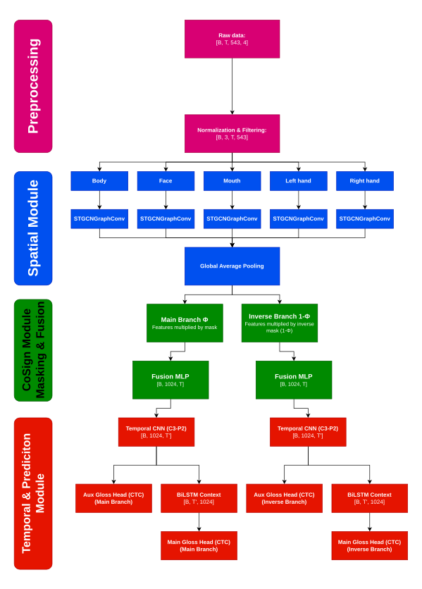

# PJM-to-text module

This repo is an attempt to create a deep learning model that does CSLR (Continous Sign Language recognition) on PJM (Polish Sign Language).

## Model Architecture

The diagram below illustrates the complete data flow and architecture of our modified CoSign model used for processing the skeleton graphs.



## Citation
```
@inproceedings{10.5555/3304222.3304273,
author = {Yu, Bing and Yin, Haoteng and Zhu, Zhanxing},
title = {Spatio-Temporal Graph Convolutional Networks: A Deep Learning Framework for Traffic Forecasting},
year = {2018},
isbn = {9780999241127},
publisher = {AAAI Press},
booktitle = {Proceedings of the 27th International Joint Conference on Artificial Intelligence},
pages = {3634–3640},
numpages = {7},
series = {IJCAI'18}
}

@InProceedings{Jiao_2023_ICCV,
    author    = {Jiao, Peiqi and Min, Yuecong and Li, Yanan and Wang, Xiaotao and Lei, Lei and
                Chen, Xilin},
    title     = {CoSign: Exploring Co-occurrence Signals in Skeleton-based Continuous Sign
                Language Recognition},
    booktitle = {Proceedings of the IEEE/CVF International Conference on Computer Vision
                (ICCV)},
    month     = {October},
    year      = {2023},
    pages     = {20676-20686}
}
@inproceedings{Yu_2018, series={IJCAI-2018},
   title={Spatio-Temporal Graph Convolutional Networks: A Deep Learning Framework for Traffic Forecasting},
   url={http://dx.doi.org/10.24963/ijcai.2018/505},
   DOI={10.24963/ijcai.2018/505},
   booktitle={Proceedings of the Twenty-Seventh International Joint Conference on Artificial Intelligence},
   publisher={International Joint Conferences on Artificial Intelligence Organization},
   author={Yu, Bing and Yin, Haoteng and Zhu, Zhanxing},
   year={2018},
   month=jul, pages={3634–3640},
   collection={IJCAI-2018} }

@misc{yan2018spatialtemporalgraphconvolutional,
      title={Spatial Temporal Graph Convolutional Networks for Skeleton-Based Action Recognition}, 
      author={Sijie Yan and Yuanjun Xiong and Dahua Lin},
      year={2018},
      eprint={1801.07455},
      archivePrefix={arXiv},
      primaryClass={cs.CV},
      url={https://arxiv.org/abs/1801.07455}, 
}
```
